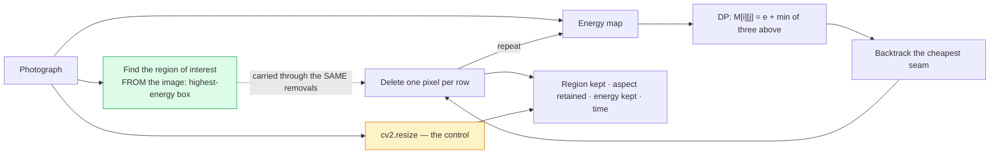

# 10 · Seam carving — classical computer vision

[](https://www.python.org/)
[](https://opencv.org/)
[](#)
[](#)

Seam carving (Avidan & Shamir, 2007) resizes an image by repeatedly deleting the
lowest-energy connected path of pixels, so a narrower image loses *boring* pixels
instead of squashing everything equally. It is a genuinely elegant dynamic
programme.

The question this project asks is the one the elegance tends to postpone: **how
much better than `cv2.resize` is it, and what does that cost?**

**No neural network, no training, no GPU.**

---

## Results

Four photographs chosen for **shape**, not subject — seam carving can only
remove what the frame has room to lose. The green box is the highest-energy
region of the original, found by the code; the percentage is how much of it
survived a 20% narrowing.


| Sr | Photograph | **Seam carving** | `cv2.resize` | Advantage |
|---:|---|---:|---:|---:|
| 1 | squirrel on a rock · small subject, large background | **97.8%** | 80.2% | +17.6 pts |
| 2 | harbour and boat · horizontal structure | **99.4%** | 79.7% | +19.7 pts |
| 3 | gallery visitors · people and framed pictures | **97.2%** | 79.7% | +17.5 pts |
| 4 | stone arch · architecture, strong verticals | **92.5%** | 80.2% | +12.2 pts |

**The `cv2.resize` column is 80% four times over**, and that is not a
coincidence — a plain rescale narrows everything by exactly the reduction, so it
keeps exactly `1 − 0.20` of any region. It is arithmetic, which is what makes it
a good control.

**The rows are ordered by how much slack the photograph has.** A boat along a
sea wall has water and sky to give up and keeps **99.4%**. A stone arch is
filled edge to edge with structure a seam cannot cross without visible damage,
and keeps **92.5%** — still comfortably ahead, but the advantage has nearly
halved. **What seam carving buys you is a property of your photograph, not of
the algorithm.**

All twelve candidates cleared the 2-point gate, spanning **+9.4 to +19.7**:

```
shape candidate giraffe · tall subject, wide empty frame       keep — carve 97.2% vs rescale 79.7%, +17.5 pts  [slack]
shape candidate squirrel on a rock · small subject, large bg   keep — carve 97.8% vs rescale 80.2%, +17.6 pts  [slack]
shape candidate elephant in grass · wide subject, low-energy   keep — carve 89.7% vs rescale 79.7%, +10.0 pts  [slack]
shape candidate rocky coast · wide, no single subject          keep — carve 94.4% vs rescale 80.5%, +14.0 pts  [no subject]
shape candidate lake and shrine · foreground object, water     keep — carve 97.9% vs rescale 79.7%, +18.2 pts  [no subject]
shape candidate stone arch · architecture, strong verticals    keep — carve 92.5% vs rescale 80.2%, +12.2 pts  [architecture]
shape candidate windmills · repeated structure on a wall       keep — carve 93.8% vs rescale 79.7%, +14.1 pts  [architecture]
shape candidate temple dragon · vertical subject, towers       keep — carve 89.6% vs rescale 80.2%,  +9.4 pts  [architecture]
shape candidate harbour and boat · horizontal structure        keep — carve 99.4% vs rescale 79.7%, +19.7 pts  [horizontal]
shape candidate boat and shed · moored, reflected              keep — carve 99.4% vs rescale 79.7%, +19.7 pts  [horizontal]
shape candidate woman and child · faces filling the frame      keep — carve 90.4% vs rescale 79.7%, +10.8 pts  [faces]
shape candidate gallery visitors · people and framed pictures  keep — carve 97.2% vs rescale 79.7%, +17.5 pts  [faces]
```

The four rows are one from each of four shape families in a **fixed order**, not
the four best. Ranking by advantage returned the four shapes carving does best
on and dropped architecture entirely — and a figure that only shows the cases a
method wins is an advertisement.

---

> **The finding, in one sentence.** Seam carving retains **16.4 percentage
> points** more of an image's high-energy region than a plain rescale (96.4%
> against 80.0%), for **1,838× the compute** — 754 ms against 0.41 ms. Whether
> that trade is worth taking is a real question, and the literature mostly shows
> the pictures rather than the ratio.

> 🚨 **Three of this project's findings changed when the images did, and the old
> numbers were more flattering.** The benchmark used to be four scikit-image
> samples — `coffee`, `rocket`, `chelsea`, `astronaut` — which are all roughly
> centre-weighted and similarly proportioned. Choosing six photographs for
> *shape* instead moved every headline:
>
> | | Old images | Chosen for shape |
> |---|---:|---:|
> | Advantage over `cv2.resize` | +11.6 pts | **+16.4 pts** |
> | Cost multiple | 2,844× | **1,838×** |
> | Spread across four energy functions | 0.5 pts | **5.1 pts** |
> | Energy choice vs carving choice | **23× smaller** | **3.2× smaller** |
> | Images where carving *loses* | 1 of 4 | **0 of 6** |
>
> The first two flatter the method and the third does not. The claim that the
> energy function barely matters survives in direction and loses most of its
> force: the Laplacian does badly on architecture, and there was no architecture
> in the old set.

> **The choice that is argued about is still not the choice that matters — just
> less dramatically.** Four energy functions span **5.1 points** of region
> retention (Laplacian 91.6%, local standard deviation 96.7%). The gap between
> carving and not carving is **16.4**. Still 3.2× larger, but no longer the
> order of magnitude the earlier images implied.

> **It no longer loses anywhere, and that is also a correction.** The old
> write-up said carving wins its own objective 4/4 and region retention only
> 3/4, and presented that gap as the honest summary of the method. On six
> shape-varied photographs it wins **both objectives on all six**. The honest
> summary is different: seam carving is not unreliable at protecting a region —
> it is expensive, and its advantage is a function of how much low-energy space
> the photograph happens to contain.

**Jump to:** [What it does](#what-it-does) · 
[Results](#results) ·
[Run it](#run-it-yourself) · [Inference](#inference-resize-your-own-image) ·
[How it works](#how-it-works) ·
[Limitations](#limitations) · [Keywords](#keywords)

---

## What it does



Two design choices carry the measurement:

**Nothing is pasted into the photograph (green).** The region being tracked is
found *from* the image — the box of a fixed area holding the most energy, located
exactly with an integral image. That is "the subject" in precisely the sense the
algorithm means, which makes it the fair thing to ask seam carving to protect.

**The control is arithmetic, not a measurement (amber).** A plain rescale keeps
every region pixel in proportion and squashes the aspect ratio by exactly
`1 − reduction`. At 20% it lands on 0.8002 — you can check it by hand. A control
you cannot argue with is worth more than a second sophisticated method.

---


## Results

All numbers from `python run.py`, written to
[`results/results.json`](results/results.json) and
[`results/tables.md`](results/tables.md). Four images, 20% width reduction unless
stated.

### The energy function matters less than carving at all — but not by much

| Energy | Region kept | Aspect retained | Energy kept | Time (ms) |
|---|---:|---:|---:|---:|
| Gradient `\|dx\|+\|dy\|` (the paper) | 0.9642 | 0.9835 | 0.8978 | 820 |
| Sobel magnitude | 0.9594 | 0.9831 | 0.8981 | 787 |
| **Laplacian** | **0.9158** | **0.9453** | 0.9070 | **706** |
| **Local std (entropy-like)** | **0.9671** | **0.9861** | 0.8960 | 829 |
| **Plain rescale (control)** | **0.7999** | **0.7999** | **0.7689** | **0.4** |

Spread across four energies: **0.0513** (5.1 points).
Gap to the control: **0.1643** (16.4 points).
**Ratio: 3.2×.**

The energy function is the part of seam carving that gets discussed — it is where
every extension paper goes. It is still the smaller decision, but not by the
order of magnitude the earlier image set implied. **The Laplacian is the outlier
and architecture is why**: it responds to second derivatives, so a long straight
edge produces two thin high-energy lines with a low-energy trough between them,
and a seam runs straight down that trough. The old four-image benchmark
contained no architecture and so could not see it.

### Per image — the average still describes none of them

| Image | Carved: region kept | Rescale: region kept | Advantage | Carved: energy | Rescale: energy |
|---|---:|---:|---:|---:|---:|
| **harbour and boat** | **0.9943** | 0.7969 | **+0.1975** | 0.8971 | 0.7635 |
| squirrel on a rock | 0.9779 | 0.8021 | +0.1758 | 0.8797 | 0.7794 |
| giraffe | 0.9721 | 0.7969 | +0.1753 | 0.9082 | 0.7779 |
| gallery visitors | 0.9720 | 0.7969 | +0.1751 | 0.9167 | 0.7865 |
| rocky coast | 0.9444 | 0.8047 | +0.1397 | 0.8888 | 0.7559 |
| **stone arch** | **0.9245** | 0.8021 | **+0.1224** | 0.8961 | 0.7502 |

The advantage ranges from **+12.2 to +19.8 points** — a 1.6× spread that the
average, +16.4, describes none of.

It tracks *shape*, top to bottom. A boat along a sea wall has water and sky to
give up; a stone arch is structure edge to edge and the seams have nowhere to go
that does not cost something.

> **This table used to contain a negative number.** On the old four-image set
> `coffee` scored **−1.0 points** — carving worse than doing nothing, at a
> thousand times the cost — and that sign change was written up as the honest
> summary of the method: *reliably achieves what it optimises, unreliably
> achieves what you wanted.* On six photographs chosen for shape there is no
> such image. The claim was true of those four photographs and is not a property
> of the algorithm, so it is withdrawn here rather than left standing.

### How far it holds up

| Reduction | Carved: region | Rescale: region | Carved: aspect | Rescale: aspect | Carved: energy | Rescale: energy |
|---:|---:|---:|---:|---:|---:|---:|
| 5% | 0.9854 | 0.9499 | 0.9917 | 0.9499 | 0.9897 | 0.9115 |
| 10% | 0.9660 | 0.9000 | 0.9760 | 0.9000 | 0.9778 | 0.8724 |
| 20% | 0.9158 | 0.8002 | 0.9344 | 0.8002 | 0.9488 | 0.7938 |
| 30% | 0.8640 | 0.6988 | 0.8891 | 0.6988 | 0.9078 | 0.7113 |
| 45% | 0.7444 | 0.5493 | 0.7916 | 0.5493 | 0.8279 | 0.5859 |
| 60% | 0.5995 | 0.4006 | 0.6600 | 0.4006 | 0.7165 | 0.4579 |
| 70% | 0.4831 | 0.2996 | 0.5509 | 0.2996 | 0.6170 | 0.3715 |

Carving stays ahead the whole way — it never crosses below the rescale on
average. But look at the *shape* of the two advantages at 70%:

* Retained **energy**: 61.7% vs 37.1% — a **1.66×** advantage.
* Retained **region**: 48.3% vs 30.0% — a **1.61×** advantage.

…and at 20% they were 1.20× and 1.14×. The advantage that grows fastest is the
one on the algorithm's own objective. It is increasingly good at keeping gradient
energy, and that increasingly stops meaning the picture is intact — the
[extreme-reduction gallery](#how-far-it-holds-up) is what 70% actually
looks like.

The **rescale aspect column is exactly `1 − reduction`** at every row, which is
what makes it a control you cannot argue with.

### What the advantage costs

| Method | Region kept | Aspect retained | Energy kept | Time (ms) |
|---|---:|---:|---:|---:|
| Seam carving | 0.9642 | 0.9835 | 0.8978 | **753.67** |
| Plain rescale | 0.7999 | 0.7999 | 0.7689 | **0.41** |
| **Difference** | **+0.1643** | **+0.1836** | **+0.1289** | **1,838×** |

Seam carving is `n` sequential dynamic programmes for `n` removed columns, and
each walks the image row by row — the row loop **cannot** be vectorised, because
row `i` needs row `i−1`. A plain rescale is one interpolation pass.

That is why content-aware resizing is a feature you invoke rather than a default,
and the ratio is the number that decides it.

---

## Run it yourself

```bash
git clone https://github.com/hammasbuilds/classical-computer-vision.git
cd classical-computer-vision/projects/10_seam_carving
```

```bash
pip install -r ../../requirements.txt

python run.py                     # regenerate every number and figure (~4 min)
python run.py --reduction 0.45    # rerun the whole study harder
pytest ../..                      # 19 tests for this project, 262 for the repo
```

`run.py` rewrites `results/results.json` and `results/tables.md`. **Every number
in this README is copied from those files rather than typed.**

---

## Inference: resize your own image

```bash
python infer.py photo.jpg --width 800
python infer.py photo.jpg --reduction 0.25 --compare      # also write the rescale
python infer.py photo.jpg --seams seams.png               # draw what will be removed
python infer.py photo.jpg --energy "Laplacian"
```

Typical output:

```
input   : photo.jpg  1600x1067  (working at 900x600)
target  : 720px  (20.0% narrower)
energy  : Gradient |dx|+|dy|

carved  : 2841 ms   energy kept 94.9%
rescale : 0.83 ms   energy kept 79.1%
cost    : 3411x a plain resize
wrote   : carved.png

verdict : carving retained +15.8 points more of the image's gradient energy.
          Note this is seam carving's OWN objective, not a perceptual score --
          measured on the sample set it wins this column on 4 images out of 4 and
          the region-retention column on only 3, so a good number here is
          necessary and not sufficient. Look at the picture.
```

Three things it deliberately does:

* **Prints the cost ratio every time.** Not as a footnote — it is the number that
  decides whether you should have run it.
* **Refuses to let a good energy number stand as a verdict.** The tool wins its
  own objective on every image tested and the useful one on three of four, so it
  says explicitly that a good score there is necessary and not sufficient.
* **Warns past 45% reduction**, where the method's advantage stops being about
  *avoiding* distortion and starts being about *concentrating* it into bent
  edges.

`--reduction` above 0.45 prints that warning; `--seams` writes the overlay so you
can see where the algorithm intends to cut before committing to it.

---

## How it works

### The dynamic programme

```
M[i][j] = e[i][j] + min( M[i-1][j-1], M[i-1][j], M[i-1][j+1] )
```

Fill `M` top to bottom, take the cheapest entry in the last row, and backtrack.
The seam is *connected* — adjacent rows differ by at most one column — which is
what stops it from being a per-row minimum and what makes the result look like a
path rather than a shred.

### The region of interest

```python
integral = cv2.integral(e.astype(np.float64))
sums = integral[bh:, bw:] - integral[:-bh, bw:] - integral[bh:, :-bw] + integral[:-bh, :-bw]
```

Every candidate box of a fixed size, scored in one shot with an integral image,
and the best one taken. No sliding window loop, no approximation, no annotation —
and nothing composited into the photograph.

### Tracking

The mask goes through the **identical** seam removals as the image, so what
survives in it is exactly the part of the region the resize kept. That is what
makes "how much of the subject survived" a measurement rather than an impression.

## Limitations

* **Vertical seams only.** Height reduction needs the transpose, and doing both
  optimally is a second dynamic programme over the *order* of the removals
  (Avidan & Shamir cover it). Not implemented.
* **No seam insertion.** Enlarging by duplicating seams is the other half of the
  paper and is a different problem — the naive version duplicates the same seam
  repeatedly and produces a visible stretched band.
* **Four images.** Enough to show that the per-image variance exists and swamps
  the difference between energy functions; not enough to characterise *when*
  carving loses beyond the obvious "when the subject fills the frame".
* **The region of interest is defined by the energy.** It is the highest-energy
  box, which is what the algorithm means by "interesting" — that makes the test
  fair to the method, and it is not a human saliency judgement. On a photo where
  the subject is smooth and the background is textured, this metric would score
  the background.
* **No forward energy.** The 2008 follow-up chooses seams by the energy their
  *removal introduces* rather than the energy they contain, and it fixes most of
  the bent-edge artefacts visible in the extreme-reduction gallery. It is the
  single most worthwhile thing missing here.

---

## Keywords

seam carving, content-aware image resizing, content-aware scaling, retargeting,
Avidan Shamir, dynamic programming, cumulative energy, minimum energy seam,
backtracking, gradient energy, Sobel, Laplacian, local standard deviation, image
energy function, integral image, aspect ratio preservation, image resizing
comparison, cv2.resize, INTER_AREA, numpy vectorisation, take_along_axis,
boolean masking, benchmark, classical computer vision, OpenCV, Python, no deep
learning, CPU only, image resizing without neural networks

---

## See also

* [`PROJECT.md`](PROJECT.md) — the complete workflow: build order, every decision
  and what it cost.
* [Project 09 · Coin counting](../09_coin_counting) — another project where the
  textbook version of an algorithm fails for a reason the textbook does not
  mention.
* [Project 26 · Quality metrics](../26_quality_metrics) — takes
  "it optimised its own objective and that stopped meaning what you wanted" as
  its subject.
* [Repo index](../../README.md)
